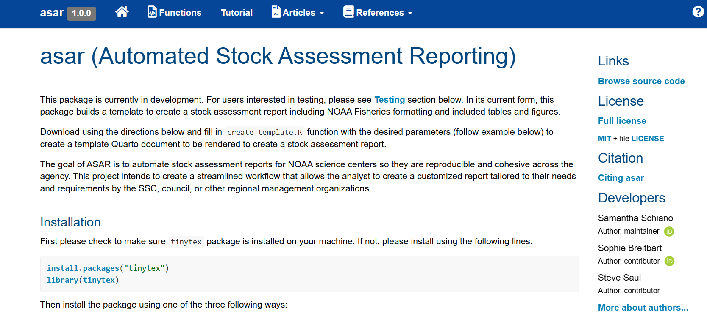
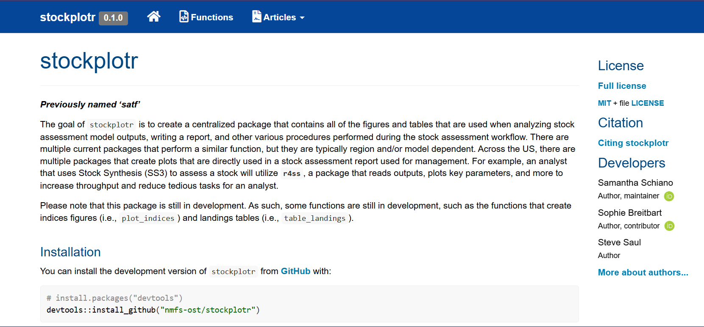

Hi there! I am an ecologist, evolutionary biologist, and data scientist. My goal is to strengthen our ecosystems by translating ecological data into insights that are meaningful for diverse audiences.

In 2024, I completed my PhD in Ecology and Evolutionary Biology at the [University of Toronto](https://eeb.utoronto.ca/), where I studied how urbanization influences the ecology and evolution of common milkweed (a favorite of Monarch butterflies). After graduating, I started a job that combines some of my favorite things: programming, communication, and ecology! Here's the gist of what I do:

[NOAA Fisheries](https://www.fisheries.noaa.gov) scientists diligently monitor the population dynamics of flounder, salmon, and other economically important (and tasty) fish that swim in US federal waters. Their goal is to use this data to formulate harvest recommendations that maximize the amount of fish that can be caught and sold as seafood, prevent overfishing, and protect marine ecosystems. If that sounds like a lot of work, it is! These scientists are constantly analyzing data for *over 500 stocks* and writing extensive [stock assessment reports](https://www.fisheries.noaa.gov/topic/population-assessments/fish-stocks) to communicate their findings.

I am a contractor who works in support of NOAA Fisheries. My main goal is to help develop two R packages ([asar](https://nmfs-ost.github.io/asar/) and [stockplotr](https://github.com/nmfs-ost/stockplotr)) that will allow fisheries scientists to write their stock assessment reports more reproducibly and efficiently. These reports can be hundreds of pages long and include dozens of figures and tables. It's been an amazing experience to learn from brilliant fisheries scientists and build the skills needed to develop R packages!

{width="450"} {width="450" height="204"}

Before graduate school, I earned my B.A. in Biology with a Certificate in Integrative Genomics Sciences from [Wesleyan University](https://www.wesleyan.edu/). Next, I was lucky enough to spend two years as a staff scientist at an [ecological restoration firm](https://princetonhydro.com/) and learn about all sorts of things--- especially field work, multi-year project management, and the value of incredible coworkers.

In my free time I like to read, quilt, explore the charm of little Rhody, and tinker with just-for-fun coding projects.
